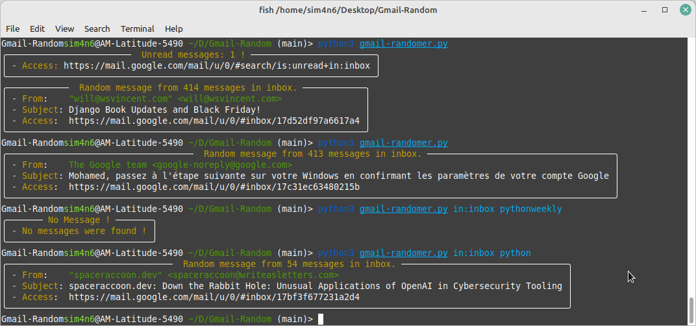

# Gmail-randomer

Pick a random message from Gmail inbox or from a provided search query.

# Set up the environment 

```
cd gmail-randomer/
pipenv shell
pipenv install
python3 gmail-randomer.py
```
You can create access credentials [here](https://developers.google.com/workspace/guides/create-credentials) 

# Usage



